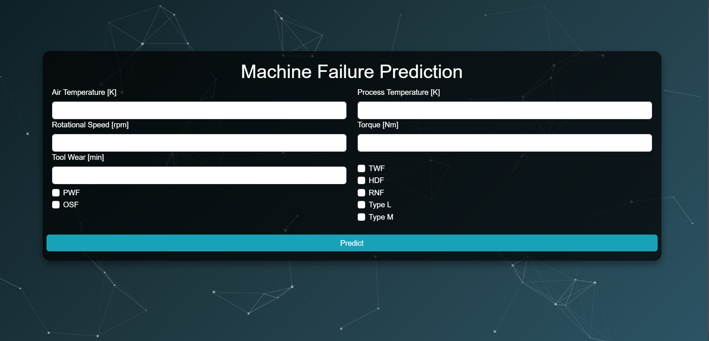

# Machine Failure Prediction

## **Overview**
The **Machine Failure Prediction** project includes two separate implementations:
1. **API-only Flask App** (`app.py`): Accepts JSON input for real-time predictions and provides probabilities and predictions for machine failures.
2. **UI-based Flask App** (`flask_app.py`): Provides a user-friendly web interface for inputting features and visualizing predictions.

Both implementations leverage a trained machine learning model to assist in proactive maintenance and decision-making.

---

## **Features**
### API-Only App (`app.py`):
- RESTful API for machine failure predictions.
- Accepts JSON input for real-time predictions.
- Returns predictions and probabilities in JSON format.

### UI-Based App (`flask_app.py`):
- Interactive web interface for inputting features.
- Dynamic visualizations and predictions displayed on the UI.
- Enhanced visuals with Particle.js for a better user experience.

---

## **Setup Instructions**

### **Prerequisites**
- Python 3.8 or higher
- Installed libraries:
  - Flask
  - pandas
  - scikit-learn
  - joblib
  - Flask-WTF (for UI app)

### **Installation**
1. Clone this repository:
   ```bash
   git clone https://github.com/raviraj-441/Machine-Failure-Prediction-API.git
   cd Machine-Failure-Prediction-API
   ```
2. Install the required dependencies
   
4. Ensure the trained model file (`best_rf_model.pkl`) is in the project directory.

---

## **Running the Applications**

### API-Only Flask App
1. Start the API-only Flask server:
   ```bash
   python app.py
   ```
2. The server will run locally at:
   ```
   http://127.0.0.1:5000
   ```

### UI-Based Flask App
1. Start the UI-based Flask app:
   ```bash
   python flask_app.py
   ```
2. Open your browser and navigate to:
   ```
   http://127.0.0.1:5000
   ```

---

## **Usage**

### API-Only App (`app.py`):
#### **Endpoint**: `/predict`
#### **Method**: POST

**Input Format**:
```json
[
  {
    "Air temperature [K]": 298.2,
    "Process temperature [K]": 308.7,
    "Rotational speed [rpm]": 1408,
    "Torque [Nm]": 46.3,
    "Tool wear [min]": 3,
    "TWF": 0,
    "HDF": 0,
    "PWF": 0,
    "OSF": 0,
    "RNF": 0,
    "Type_L": 1,
    "Type_M": 0
  }
]
```

**Response Format**:
```json
{
  "predictions": [0],
  "probabilities": [[0.95, 0.05]]
}
```
- `predictions`: Predicted class (0 = No failure, 1 = Failure).
- `probabilities`: Probabilities for each class.

---

### UI-Based App (`flask_app.py`):
1. Open the UI in your browser.
2. Input feature values through the web interface.
3. Click "Submit" to view the prediction (e.g., "Machine is Fine" or "Machine Failure") and associated probabilities.

---

## **Screenshots**
### UI-Based App:
 

---

## **Sample Data**
Use the following data for testing either app:
| Air temperature [K] | Process temperature [K] | Rotational speed [rpm] | Torque [Nm] | Tool wear [min] | TWF | HDF | PWF | OSF | RNF | Type_L | Type_M |
|----------------------|--------------------------|-------------------------|-------------|----------------|-----|-----|-----|-----|-----|--------|--------|
| 298.2               | 308.7                   | 1408                    | 46.3        | 3              | 0   | 0   | 0   | 0   | 0   | 1      | 0      |

---

## **Acknowledgments**
- Dataset: [AI4I 2020 dataset](https://archive.ics.uci.edu/ml/datasets/AI4I+2020+Predictive+Maintenance+Dataset)
- Libraries: Flask, scikit-learn, pandas

---

## **License**
This project is licensed under the MIT License.
